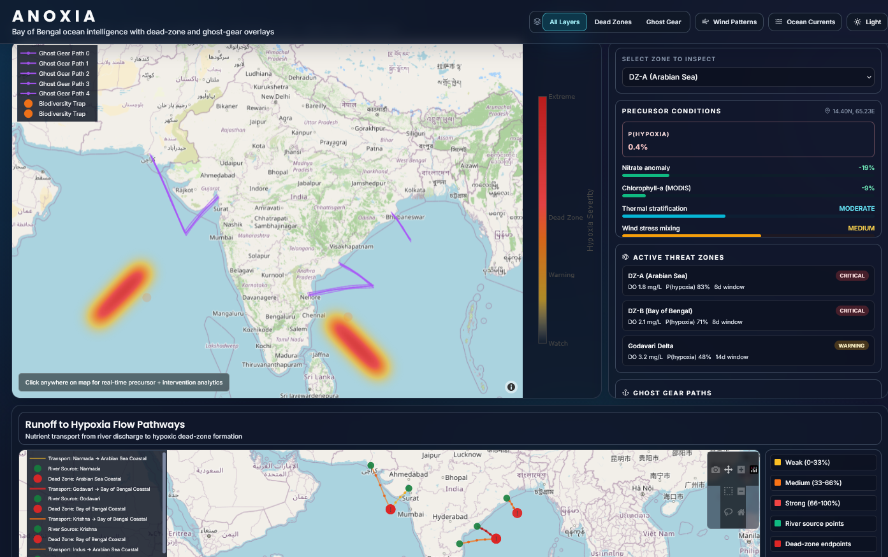

# ANOXIA — Oceanographic Dead Zone Prediction & Intervention System

## Hackathon Project

**Team Name: Oblivian**

## Live Demo

- Deployed App: [https://anoxia-six.vercel.app/](https://anoxia-six.vercel.app/)

## Current UI



---

## Problem Statement

Ocean dead zones (hypoxia) — where dissolved oxygen drops below survivable levels — are rapidly expanding across the Arabian Sea and Bay of Bengal, driven by human activity and climate change.

**The Pollution Engine:** Agricultural runoff contributes approximately 78% of nitrogen loading in Indian waters. In the Bay of Bengal, high river discharge accelerates eutrophication, depleting oxygen and rendering productive fishing grounds biologically unusable. Indian waters have seen a 25% increase in hypoxic events, with fishing zones shrinking as a result.

**The Biodiversity Trap:** As oxygen drops, mobile species like Indian Oil Sardine and Mackerel get compressed into dense survival zones. Non-mobile ecosystems — coral reefs and sea fans in the Gulf of Mannar — cannot escape, leading to mass mortality. Heat combined with low oxygen accelerates ecosystem collapse by a factor of 3.6×.

**Blind Operational Over-Exertion:** Hypoxia is invisible to fishers. Fleets unknowingly burn fuel searching barren waters, deploy nets into dead zones, and lose gear in unusable areas — causing economic losses across 36,000+ vessels. No 30-day predictive early warning system currently exists; detection remains entirely reactive.

---

## Solution

ANOXIA is a real-time geo-spatiotemporal modeling system combining Hypoxia prediction and Lagrangian Drift modeling through a two-engine machine learning architecture.

**Engine 1 — Dead Zone Engine (Biochemical Intelligence):** Uses a two-stage LSTM deep learning model to predict hypoxia before it occurs. Stage 1 learns precursor patterns (temperature anomalies, chlorophyll blooms, nitrate spikes, stratification); Stage 2 predicts bottom-water oxygen decline. Output: hypoxia probability maps with a 7–30 day early warning lead time.

**Engine 2 — Ghost Gear Engine (Physical Ocean Modeling):** Uses Lagrangian Drift Modeling with HYCOM ocean current vectors to track trajectories of lost fishing nets over time. When drift paths intersect predicted hypoxia zones, the system creates Biodiversity Trap Zone alerts with a 3.4× mortality multiplier applied.

**Fusion Layer:** Both engines feed into a spatial overlay that detects critical intersections between hypoxia zones and drift corridors. The system produces a single ecological risk score per location, alongside actionable coordinates for Coast Guard retrieval and fisher rerouting.

**Data Inputs:** The system ingests MODIS/VIIRS satellite data (chlorophyll, SST), Argo/INCOIS float profiles (dissolved oxygen, temperature, salinity), HYCOM ocean current fields, AIS/VMS vessel tracks for gear-loss inference, river runoff/nitrate loading data, and Global Fishing Watch activity hotspots.

**What ANOXIA delivers:**
- Predicted hypoxic zones with 30-day advance warning
- Real-time ghost gear drift paths and convergence hotspots
- Biodiversity trap alerts at high-risk intersections
- Intervention-ready spatial coordinates for Coast Guard and fishing fleets
- Decision intelligence converted from raw environmental data

  
  SYSTEM ARCHITECTURE


---

## Tech Stack

**Frontend:**
- Plotly Dash 2.14.1 — interactive UI framework
- Plotly 5.17.0 — interactive map visualization and charting
- Flask 3.0.0 — web server
- Flask-CORS 4.0.0 — cross-origin request handling

**Backend:**
- Flask 2.3.0 — REST API framework
- Flask-CORS 4.0.0 — API CORS handling
- NumPy 1.24.3 — numerical computations
- SciPy 1.11.0 — spatial interpolation and scientific functions
- XGBoost — gradient boosting hypoxia classifier
- Pandas — data manipulation and feature matrices
- NetCDF4/xarray — scientific data formats (HYCOM, MODIS)
- ERDDAP API — ocean data access
- OPeNDAP — remote data protocol (HYCOM THREDDS)

**Database / Storage:**
- JSON — GFW seed points, Argo profiles
- Parquet — feature matrices (snappy compression)
- NetCDF — HYCOM ocean current fields, MODIS chlorophyll
- CSV — study region metadata

---

## How to Run

### Quick Start

**1. Install dependencies**

```bash
# Install frontend dependencies
cd frontend
pip install -r requirements.txt

# Navigate back and install backend dependencies
cd ..
pip install -r backend_requirements.txt
```

**2. Start the backend API server** (Terminal 1)

```bash
python backend_api.py
```

The API will start on `http://localhost:5000`.

**3. Start the frontend dashboard** (Terminal 2)

```bash
cd frontend
python app.py
```

The dashboard will be available at `http://127.0.0.1:8050`.

**4. Open the dashboard**

Navigate to **http://127.0.0.1:8050** in your browser. You should see the interactive map of the Arabian Sea and Bay of Bengal, with dead zone markers, precursor heatmaps, drift trajectories, and a zone status panel. Click any location on the map to load precursor conditions and intervention recommendations in the sidebar.

---

### Full Installation (Development)

```bash
# Navigate to project directory
cd c:\Users\sujat\Anoxia

# Create and activate virtual environment
python -m venv venv
venv\Scripts\activate  # Windows

# Install all dependencies
pip install -r backend_requirements.txt
pip install -r frontend/requirements.txt

# Run backend (Terminal 1)
python backend_api.py

# Run frontend (Terminal 2)
cd frontend
python app.py
```

---

### Running Tests

```bash
python test_backend_api.py
```

Expected result: `7/7 TESTS PASSING ✅`

---

### API Endpoints

| Endpoint | Description |
|----------|-------------|
| `GET /api/health` | Health check |
| `GET /api/precursor-conditions/{lat}/{lon}` | Precursor conditions at a coordinate |
| `GET /api/wind-vectors` | 102 wind vectors across Arabian Sea + Bay of Bengal |
| `GET /api/ocean-currents` | 102 current vectors (m/s) |
| `GET /api/fertilizer-runoff` | Nitrate grid and river discharge sources |
| `GET /api/dead-zone-markers` | Predicted dead zone locations with severity scores |

Example:
```bash
curl http://localhost:5000/api/precursor-conditions/15.5/70.0
```

---

### Troubleshooting

**Backend won't start:** Check if port 5000 is already in use.
```bash
netstat -ano | findstr :5000   # Windows
taskkill /PID <pid> /F
```

**Frontend can't connect to API:** Ensure the backend is running and CORS is enabled in `backend_api.py`. Verify fetch calls point to `http://localhost:5000`.

**Missing data files:** Re-download using the scripts in `/anoxia/`:
```bash
python download_hycom.py --days 10
python download_modis_aqua_chl_8day.py
python download_argo_profiles.py
```
